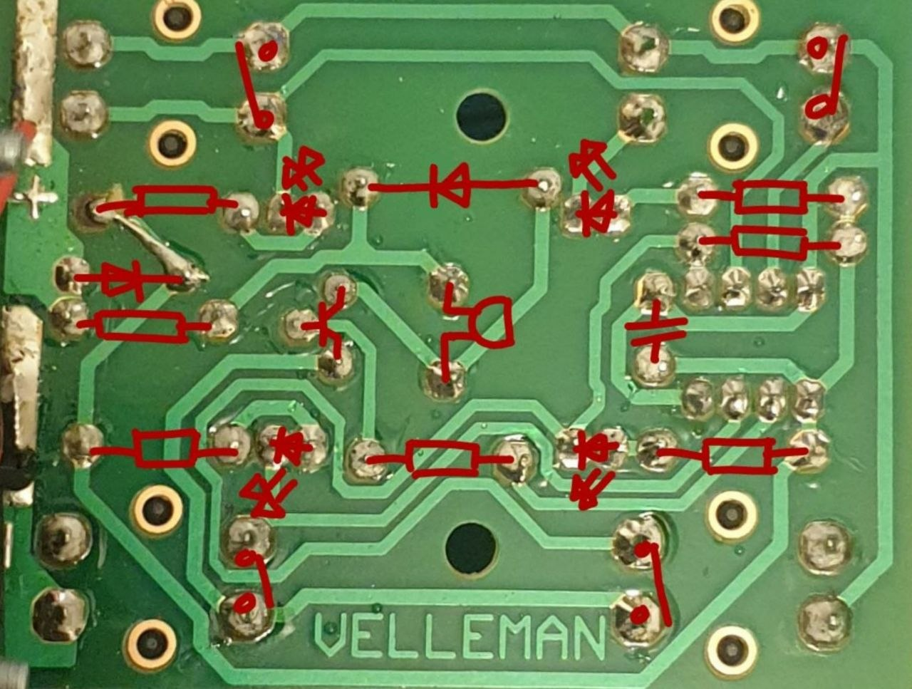
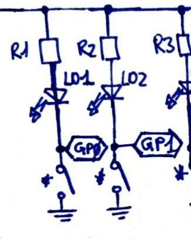
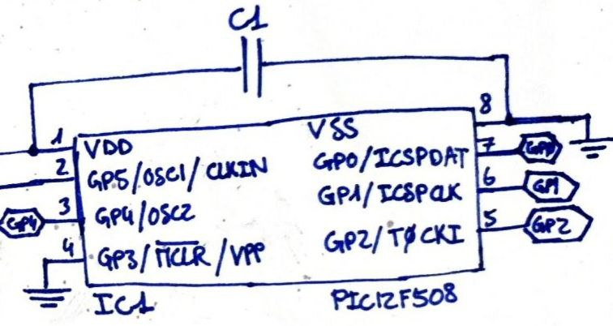
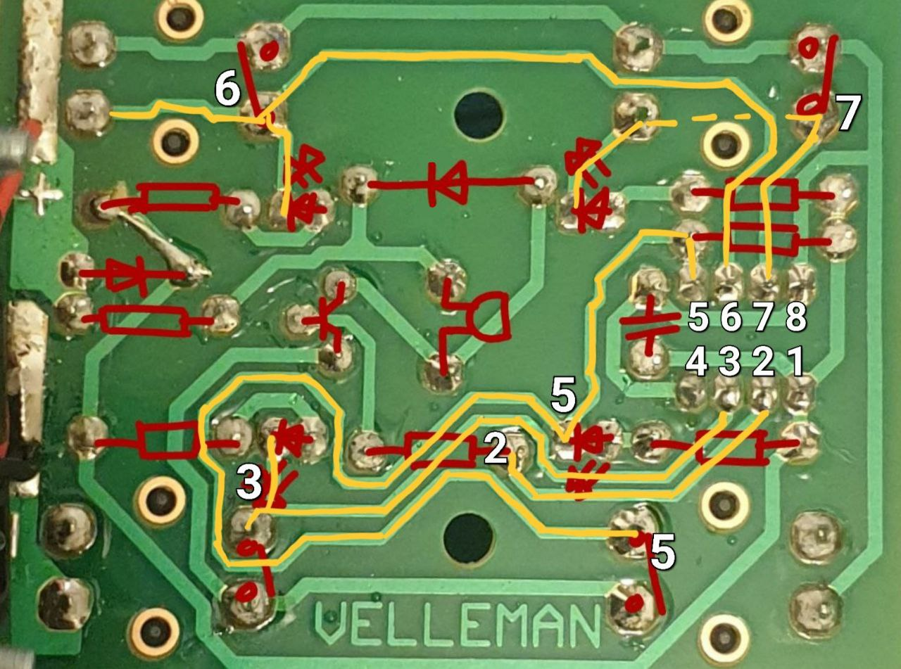
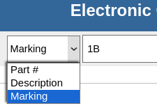
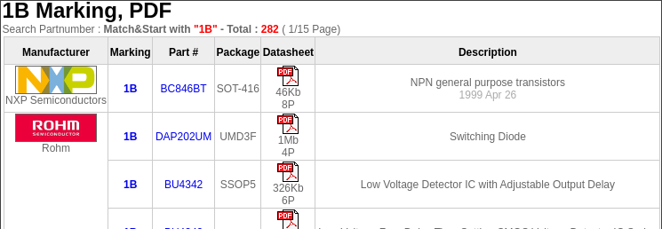

# RE-Velleman-BrainGame

Hardware reverse engineering of a small brain game. The
[**WSG112**](https://www.velleman.eu/products/view/brain-game-wsg112/?id=459282)
by Velleman.

This was done mostly in order to create a custom housing and
to reprogram the uC to play different sounds than the defaults on the buzzer.

## Analysis

### Quick notes

1. As a first approach, take a picture of the circuit and
draw components/expected components over it.

    

2. Then, before starting on an
[**EDA software**](https://en.wikipedia.org/wiki/Electronic_design_automation),
draw the schematic on paper. I find it easier to correct it that way.

3. Don't hesitate **to note the value of a component** right
as you identify it (typically for resistors).

    You'll avoid to look after each component again, once the analysis is done.

    For those that are labelled, take note of it. You can then use tools,
like [**ALLDATASHEET**](https://www.alldatasheet.com),
to further identify them.

    **That's why it is important to have some basic knowledge about electronics.**

    It is easier for someone to understand a system,
if components are already known. Anyone can do it, but not as fast.

    *Quick example*: I see a 3 pins component (form factor: SOT23)
with one pin connected to either a power or the ground,
and one pin connected to a chip labelled with PIC16F... something.

    I can already know that there is a uC from Microchip that
drives a transistor/mosfet driving something else (LED, motor, ...).

Now, let's dive into the analysis!

### 1. Power

For me, the best start is to begin with
the powers (System's input, Regulator(s), GND, ...).

**Why?**

From my perspective, it is easy to understand the components on it.

1. On an embedded system, near its power input, you'll likely find a switch
to power on and off the system.

    In this case, there's no system on/off switch.

    <!-- Switches are use to wake the system up,
      -- after it has been put in sleeping mode.
    -->

2. Then, you'll get driving comps, like transistors, mosfets, ...
Those driving external elements (motors, servo, LEDs, ...) are
then usually connected to connectors afterwards.

    Here, it is a bit particuliar as each switch and LED couple creates a
    branch, and each branch works through one same pin of the controller:

    

    <!-- The system works on waiting a switch interaction. (GPIOs as inputs)
      -- Then, it proceeds to the LEDs sequences.          (GPIOs as outputs)
      -- LEDs sequence done, the system will wait on the 
      -- user's inputs to check the sequence.              (GPIOs as inputs)
      --
      -- The session done, the cycle repeats.
    -->

    *Note*: You'll find details on how I imagine it works in the
[***raw version***](https://raw.githubusercontent.com/D3epCr3ature/RE-Velleman-BrainGame/refs/heads/main/README.md),
between the above picture and this note.

3. You'll be led around regulators where you'll find common comps,
such as: resistors, capacitors and coils, in most cases.

    With more advanced regulators, you may find transistors or else as well.

    There's no regulator on this system, as everything works on 
the input's power (4.5V or 3x1.5V AAA cells).

4. From the powers, you can also identify decoupling capacitors.
Thus removing almost one to multiple comps around any chips
(multiple, as some controller have decoupling for
chip's own power, analog pin's power, ...).

    As there's only one controller and no regulator,
only one decoupling capacitor is found:

    

### 2. Controller

Now that power lines have been analyzed, a second point is to look
for controllers (uC, control switches, ...).

Start from what you've seen already. Elements from point 2 of
the previous title (driving components).

Like so, you'll see components all the way from your *driver* to the controller.
Thus easing the analysis from in-between signals later on.

Then treat remaining pins, that are not connected to anything seen until now.

*Note*: Indeed, some elements like LEDs, could be connected directly
to the controller.

There, we can identify that:

- Pin 6 manages LED and switch in **Top-Left**

- Pin 7 manages LED and switch in **Top-Right**

- Pin 5 manages LED and switch in **Bottom-Right**

- Pin 3 manages LED and switch in **Bottom-Left**

- Pin 2 manages the buzzer
(through a resistor connected to the base of the transistor)

### 3. Remaining lines

Now, you have all the remaining/in-between traces to draw out.

### 4. Component identification

After redrawing the schematic, get to the component identification.

On this project, every component can be read from its packaging.

Resistors can be read through their color code.

Diodes are explicitly marked. <!-- 1N4001, ... -->

The only transistor is also fully marked with its model. <!-- BC546 -->

So here's an example not related to the project.

For instance, let's say we have a 3 pins SOT23 comp labelled 1B:

- Go to [**ALLDATASHEET**](https://www.alldatasheet.com/)

- Here, we're looking for a marking of 1B:

    

- Some first results:

    

It will likely be a general purpose transistor.
Having an idea of components beforehand will ease your research on this.

Now, you've got the idea and you can continue on your own. :wink:

## What now?

After completly redrawing the schematic, you can do a clean version in an EDA.

Now, it's up to you on what you want to do.

For example, you could:

- Recreate the system

  - Change obsolete components

- Like me, simply use it to reprogram the micro-controller.

- Create a housing, as it has none by default.

- And the list goes on! The possibilities are limitless,
as long as you have imagination to spare for it. :wink:

## Sidenote

You can look at the 
[***raw version***](https://raw.githubusercontent.com/D3epCr3ature/RE-Velleman-BrainGame/refs/heads/main/README.md)
of this README.

I added some technical informations on the system's behavior and
on how it is working (or how I would program it, based on the hardware).

Plus, you'll find the raw version of how I did my analysis
in the [**01-Doc**](01-Doc/RevEng-BrainGame.pdf) folder.
